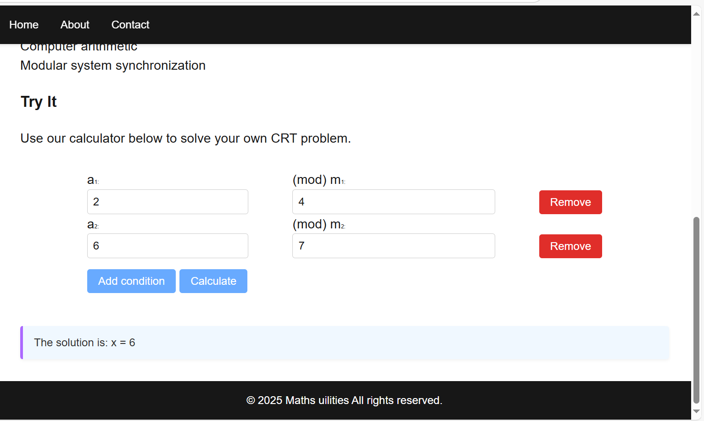

# 🧮 Maths Utilities

This is a simple yet powerful web application built in PHP for performing various math-related computations. The main feature currently supported is solving systems of congruences using the **Chinese Remainder Theorem (CRT)**.

## 📌 Features

- ✅ Solve CRT problems for 2 or more modular congruences.
- ➕ Dynamically add/remove congruence conditions.
- ⚠️ Handles invalid input and non-coprime moduli with clear error messages.
- 🧪 Includes unit tests for verifying correctness.
- 💡 Clean interface with dynamic feedback.
- 📧 Contact page for feedback or inquiries (sends email).
- 🖼️ Visual example included.

## 🖥️ Getting Started

### 1. Clone the Repository

```bash
git clone https://github.com/thabel/maths_utilities.git
cd maths_utilities
````

### 2. Serve the Application Locally

You can run the project using PHP’s built-in server:

```bash
php -S localhost:8000
```

Then open your browser and go to:

```
http://localhost:8000/index.php?tool=crt
```

## 📷 Screenshot

Here’s what the CRT tool looks like in action:



## 🧪 Run Tests

Navigate to the `tests/` directory and run:

```bash
php test_crt.php
```

This will execute unit tests and show which CRT cases pass or fail.

## 📫 Contact

Visit the `/contact` page within the app to send a message to the developer.

## 🗂️ Project Structure

```
maths_utilities/
├── index.php
├── assets/
│   └── images/
│       └── exemple.png
├── tools/
│   └── crt.php
├── templates.php
├── tests/
│   └── test_crt.php
└── README.md
```

## 🧠 Example CRT Problem

Solve:

```
x ≡ 2 mod 3
x ≡ 3 mod 4
x ≡ 2 mod 5
```

The solution is:

```
x ≡ 47 mod 60
```

---

Made with ❤️ by [thabel](https://github.com/thabel)

